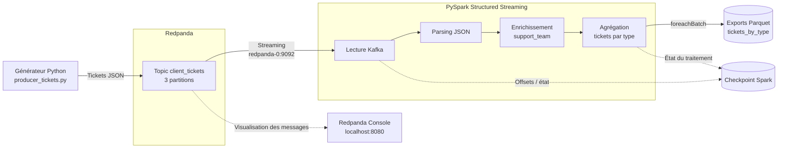
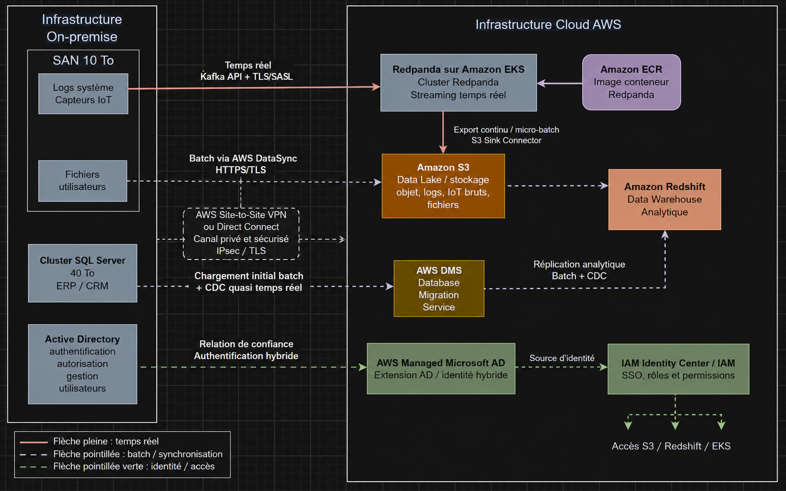

# POC - Pipeline temps réel de tickets clients InduTech

## Contexte

InduTech souhaite mettre en place un pipeline permettant d'ingérer, traiter et analyser en temps réel les tickets générés par ses clients.

Ce Proof of Concept simule une architecture de streaming utilisant **Redpanda** pour l'ingestion des événements et **Apache Spark Structured Streaming / PySpark** pour leur traitement.

L'ensemble de l'environnement est conteneurisé et orchestré avec **Docker Compose**.

---

## Objectifs

Le POC permet de :

- générer automatiquement des tickets clients fictifs ;
- publier ces tickets dans un topic Redpanda ;
- consommer les événements en temps réel avec PySpark ;
- parser et transformer les données ;
- associer automatiquement une équipe support selon le type de demande ;
- agréger le nombre de tickets par type ;
- exporter les résultats au format Parquet ;
- conserver les checkpoints Spark pour permettre la reprise du traitement ;
- démarrer l'ensemble du pipeline avec une seule commande Docker Compose.

---

## Architecture du pipeline



### Flux de données

Le script `producer_tickets.py` simule l'arrivée continue de tickets clients.

Chaque ticket contient notamment :

| Champ | Description |
|---|---|
| `ticket_id` | Identifiant unique du ticket |
| `client_id` | Identifiant du client |
| `created_at` | Date et heure de création |
| `request` | Description de la demande |
| `request_type` | Type de demande |
| `priority` | Niveau de priorité |

Les tickets sont publiés au format JSON dans le topic Redpanda `client_tickets`.

PySpark consomme ensuite ce topic en streaming, transforme les messages Kafka en colonnes structurées puis enrichit les tickets avec une équipe support.

Exemples :

| Type de demande | Équipe |
|---|---|
| `facturation` | Équipe Facturation |
| `incident_technique` | Équipe Technique |
| `demande_information` | Service Client |
| `modification_compte` | Gestion des Comptes |
| `resiliation` | Équipe Rétention |

Une agrégation calcule ensuite en continu le nombre de tickets par type de demande.

Les résultats sont exportés au format **Parquet** afin de pouvoir être exploités ultérieurement par des outils analytiques ou de visualisation.

---

## Architecture cible hybride

Le POC local représente une partie d'une architecture hybride plus large envisagée pour InduTech.



Cette architecture cible prévoit notamment l'utilisation de services AWS tels que Redpanda sur Amazon EKS, Amazon S3, Amazon Redshift et AWS DMS.

Le POC présenté dans ce dépôt se concentre sur la chaîne de streaming :

```text
Producteur → Redpanda → PySpark → Parquet
```

---

## Structure du projet

```text
.
├── docker/
│   ├── producer/
│   │   └── Dockerfile
│   ├── redpanda/
│   │   └── Dockerfile
│   └── spark/
│       └── Dockerfile
│
├── scripts/
│   ├── producer_tickets.py
│   ├── spark_streaming.py
│   └── read_export.py
│
├── exports/
│   └── tickets_by_type/
│
├── docs/
│   └── infrastructure_hybride.png
│
├── docker-compose.yml
├── .dockerignore
├── .gitignore
├── pyproject.toml
├── uv.lock
└── README.md
```

---

## Prérequis

Le seul prérequis nécessaire pour lancer l'ensemble du POC est :

- Docker Desktop avec Docker Compose.

Python, Redpanda, Spark et les dépendances nécessaires sont directement intégrés dans les images Docker.

---

## Démarrage du POC

Depuis la racine du projet :

```bash
docker compose up --build -d
```

Cette commande :

1. construit les images Docker du projet ;
2. démarre Redpanda ;
3. attend que Redpanda soit opérationnel ;
4. crée automatiquement le topic `client_tickets` ;
5. démarre le générateur de tickets ;
6. démarre le traitement PySpark ;
7. exporte automatiquement les résultats en Parquet.

Vérifier les conteneurs :

```bash
docker compose ps
```

Les principaux services doivent être actifs :

```text
redpanda-0
redpanda-console
ticket-producer
spark-streaming
```

Le conteneur `redpanda-init` termine avec le statut `Exited (0)` après avoir créé le topic. Ce comportement est normal.

---

## Vérification de Redpanda

L'interface Redpanda Console est accessible à l'adresse :

```text
http://localhost:8080
```

Les messages peuvent être consultés dans :

```text
Topics → client_tickets → Messages
```

Le topic peut également être inspecté en ligne de commande :

```bash
docker compose exec redpanda-0 rpk topic describe client_tickets
```

---

## Vérification du producteur

Afficher les logs du générateur :

```bash
docker compose logs -f producer
```

Les tickets sont générés automatiquement et envoyés à Redpanda.

`Ctrl+C` permet de quitter l'affichage des logs sans arrêter le conteneur.

---

## Vérification de Spark Streaming

Afficher les logs Spark :

```bash
docker compose logs -f spark-streaming
```

PySpark consomme les tickets du topic `client_tickets`, applique les transformations puis actualise les résultats analytiques.

---

## Résultats Parquet

Les résultats sont écrits dans :

```text
exports/tickets_by_type/
```

Ce répertoire contient plusieurs fichiers Parquet, par exemple :

```text
_SUCCESS
part-00000-....snappy.parquet
part-00001-....snappy.parquet
part-00002-....snappy.parquet
```

Le format Parquet a été choisi car il est particulièrement adapté aux traitements analytiques : il est colonnaire, compressé, conserve le schéma des données et permet à Spark de limiter les données lues aux colonnes nécessaires.

---

## Performance

Le topic `client_tickets` utilise plusieurs partitions afin de permettre le parallélisme lors de la consommation des événements.

Spark est configuré avec un nombre limité de ressources adapté au contexte du POC.

Le nombre de partitions de shuffle est également configuré afin d'éviter de générer un nombre excessif de petites tâches pour le faible volume de données de démonstration.

Ces paramètres seraient à ajuster selon la volumétrie réelle dans un environnement de production.

---

## Résilience

Plusieurs mécanismes améliorent la résilience du pipeline.

Le producteur Kafka utilise des accusés de réception, des retries et l'idempotence pour limiter le risque de perte ou de duplication des messages.

Spark Structured Streaming utilise un répertoire de checkpoint persistant. Les offsets consommés et l'état du traitement peuvent ainsi être restaurés après le redémarrage du conteneur Spark.

Le comportement peut être testé avec :

```bash
docker compose restart spark-streaming
```

Le traitement reprend alors à partir de son checkpoint.

---

## Arrêt du POC

Pour arrêter les conteneurs :

```bash
docker compose down
```

Pour supprimer également les volumes Docker :

```bash
docker compose down -v
```

Attention : la seconde commande supprime notamment les données persistées par Redpanda et les checkpoints Spark.

---

## Démonstration vidéo

Une démonstration du POC est disponible ici :

**[Voir la démonstration vidéo](https://youtu.be/pkAgr07dHXo)**

La vidéo présente :

1. l'architecture du POC ;
2. le lancement avec `docker compose up --build -d` ;
3. les conteneurs Docker ;
4. la génération automatique des tickets ;
5. leur visualisation dans Redpanda Console ;
6. leur traitement avec PySpark ;
7. la génération des fichiers Parquet ;
8. le mécanisme de reprise grâce aux checkpoints.

---

## Technologies utilisées

- Python 3.11
- Redpanda
- Apache Spark 3.5.6
- PySpark Structured Streaming
- Kafka API
- Docker
- Docker Compose
- Apache Parquet
- Mermaid